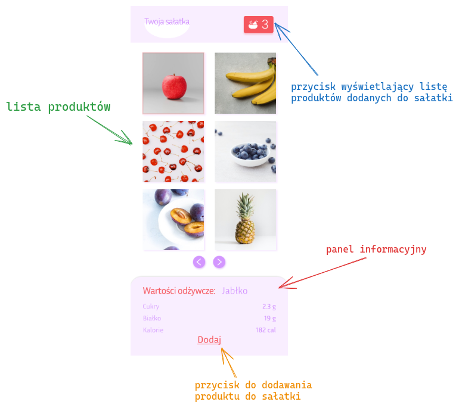
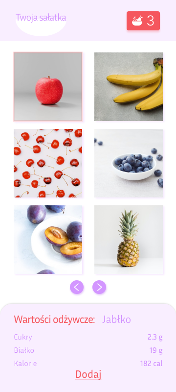
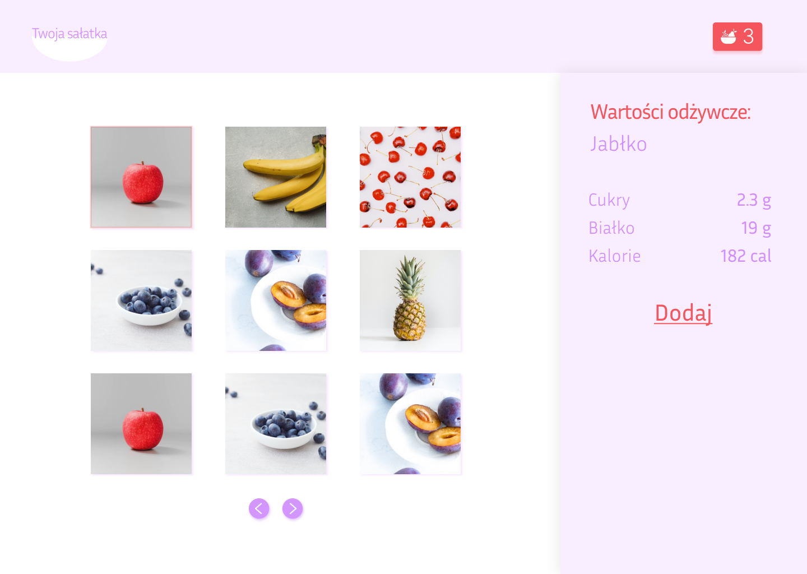
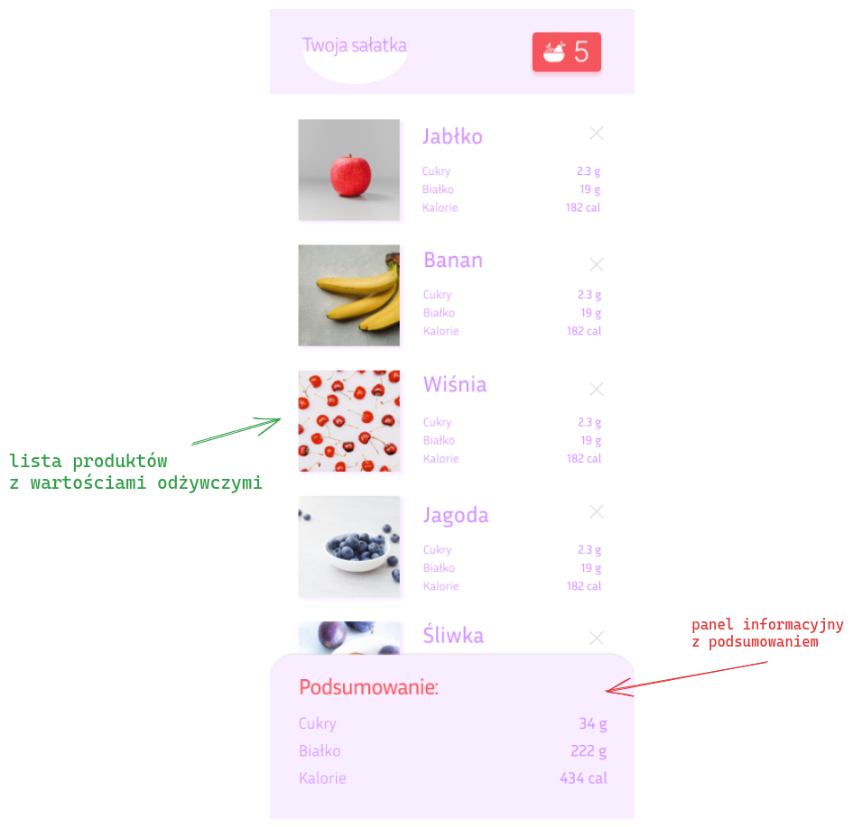
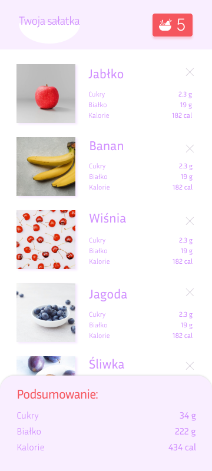
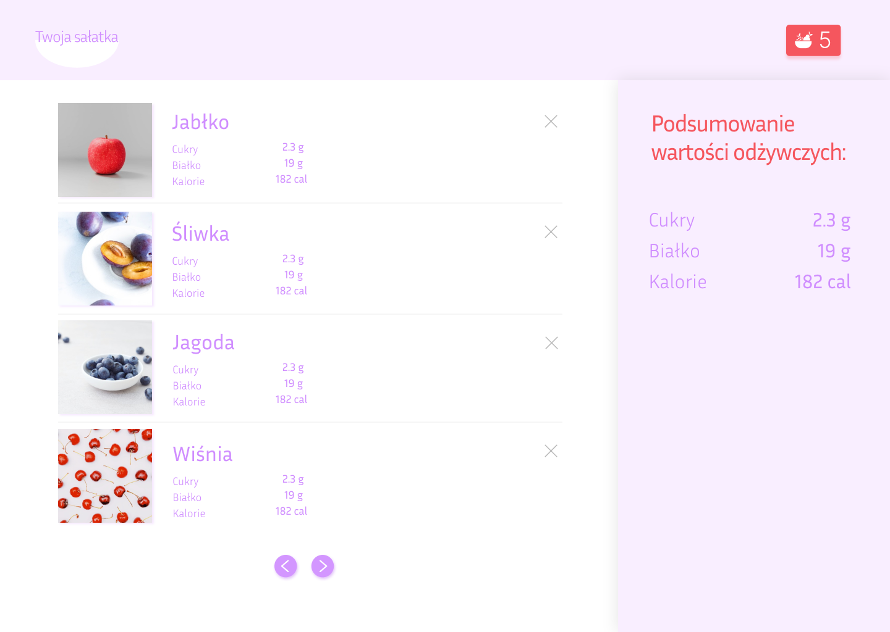

# Specyfikacja

**My salad** to aplikacja, dzięki której możliwe jest skomponowanie sałatki na podstawie udostępnionych produktów.

Aplikacja składa się z dwóch stron:

- strona do dodawania składników do sałatki
- strona do zarządzania zawartością sałatki

Każda ze stron zawiera trzy główne komponenty:

- listę produktów
- panel zawierający informację o produkcie/sałatce wyświetlany następująco:
  - na dole ekranu - dla urządzeń mobilnych
  - po prawej stronie - dla urządzeń desktopowych
- przycisk zawierający liczbę produktów dodanych do sałatki. Po kliknięciu tego przycisku użytkownik powinien zostać przekierowany do strony zarządzania zawartością sałatki.

## Źródła danych potrzebne do zaimplementowania aplikacji

Do zaimplementowania funkcjonalności aplikacji będą potrzebne następujące API:

- [Pexels API](https://www.pexels.com/api/documentation/) - zdjęcia produktów
- [Fruityvice API](https://www.fruityvice.com) - informacje o wartościach odżywczych produktów

## Strona tworzenia sałatki

### Elementy strony

#### Lista produktów

- Lista powinna wyświetlać **niewielki wycinek** całej listy produktów
- Dostęp do pozostałej zawartości listy powinien być możliwy z wykorzystaniem **paginacji**.

#### Panel informacyjny

- W panelu informacyjnym powinny się wyświetlać informacje o wartościach odżywczych wybranego produktu
- Panel ten powinien posiadać przycisk, po którego kliknięciu wybrany produkt powinien zostać dodany do sałatki

### Widoki

#### Urządzenia mobilne:

#### Urządzenia desktopowe

## Strona zarządzania zawartością sałatki

### Elementy strony

#### Lista dodanych składników

- powinna zawierać produkty wraz z ich wartościami odżywczymi
- podobnie jak w przypadku listy produktów na stronie głównej, do wyświetlania zawartości listy produktów znajdujących się w sałatce należy użyć paginacji, aby ograniczyć liczbę widocznych produktów na stronie
- składniki sałatki powinny być usuwalne z listy

#### Panel informacyjny

- powinien wyświetlać wartości odżywcze utworzonej sałatki

### Widoki

#### Urządzenia mobilne:

#### Urządzenia desktopowe

